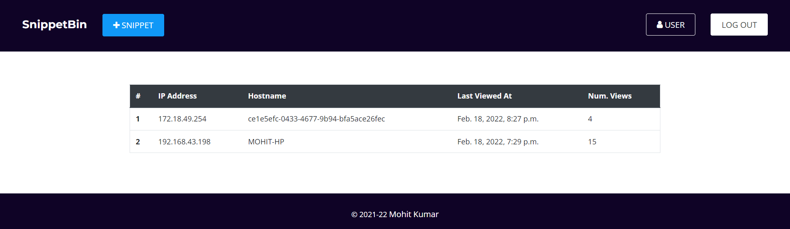
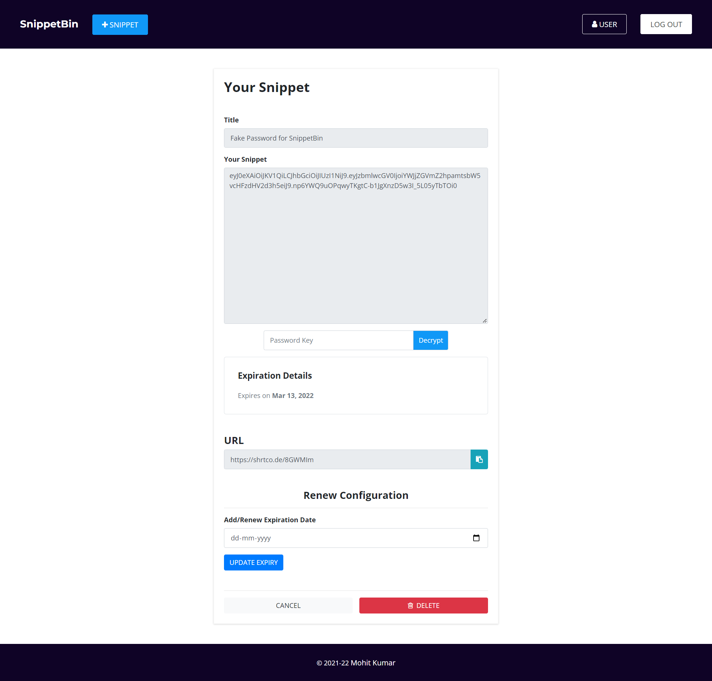

# SnippetBin

It is a Django-based web application where users can dump/paste some content or code of any language and they receive a short link to share it.

This application is provided with features like -

1. Basic Authentication and Authorization with help of Login/Signup.
2. Dashboard page for users where users can see their details and snippets created by them.
3. User can create, update and delete snippets.
4. User can also set the expiry for the snippet created. By default, expiry is set to never but the user can set it to 1 day or any date as per their wish.
5. Encryption feature is provided to encrypt their snippet which can only be read by decrypting it with the encryption key which was used to encrypt the snippet.
6. Users can renew the expiration date of a particular snippet that was created by them whenever they wish.
7. User is provided with a short/tiny URL to share his/her snippets with anyone.
8. When a direct link is pasted instead of text in the textbox then the shortened link points to that link mentioned in the textbox.
9. Users can see statistics for a particular snippet where the snippet was accessed by the different users are stored in the sorted manner of time. Here, the user can see which IP recently viewed the link and how many times he/she has opened the link.

## Project Setup

1. Create Virtual Env : `py -m venv env`
2. Activate Virtual Env : `env\Scripts\activate`
3. Install Requirements : `pip install -r requirements.txt`
4. Start Server : `python manage.py runserver`

### Tech Stack/ framework used

`Django` `Python` `HTML` `CSS` `Javascript` `Bootstrap` `Django REST Framework`

### Project Deployment Link - [snippetbin.herokuapp.com](https://snippetbin.herokuapp.com)

### Video Demo Link - [vimeo.com/678863694](https://vimeo.com/678863694)

### NOTE:

**This website is not mobile-friendly as the UI is not responsive for smaller screens. It will work perfectly on desktop**

## MORE IMAGES

### SnippetBin Signup Page

### SnippetBin Dashboard Page

### Snippet Detail Page

### Snippet Statistics Page

### SnippetBin Create Snippet Page

### Edit snippet expiration date

### Encrypted Snippet content

### SnippetBin Login Page

